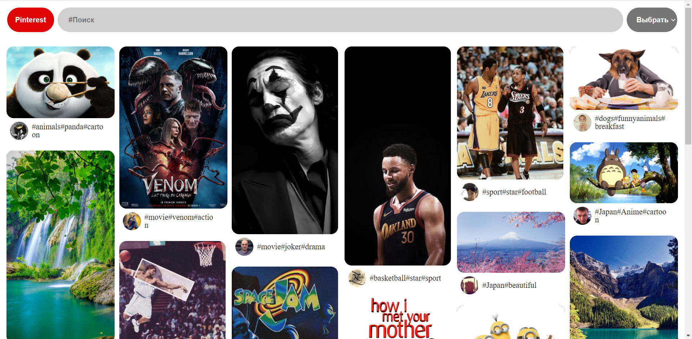
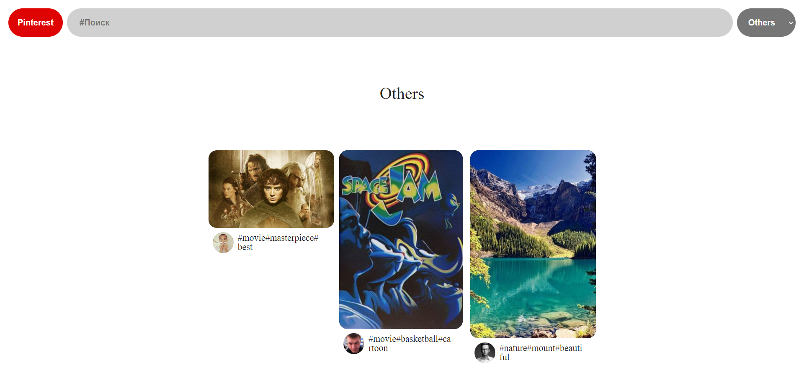
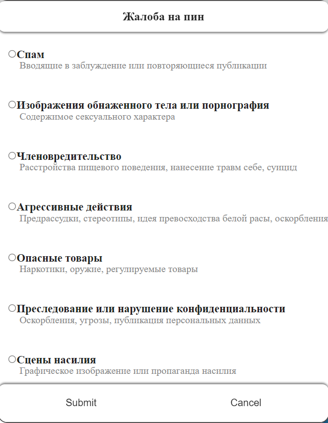

# Pinterest

Pinterest is a visual discovery engine for finding ideas like recipes, home and style inspiration, and more.

## Technology

1. HTML;
2. SCSS;
3. JavaScript;
4. Masonry;
5. Parcel;
6. LocalStorage;

## Description

Данный проект это клон приложения Pinterest, он позволяет сохранять понравившиеся изображения на различные доски, поиск изображений по тегу. Для сохранения карточек на различных досках используется LocalStorage. В качестве сборщика проекта использовался Parcel.

- ### Mail page

<p align="center"></p>

На главной странице располагается поисковая строка, кнопка перехода между досками с изображениями и набор карточек с изображениями.

- ### Card

<p align="center"></p>

На каждой карточке при наведении появляются кнопка "Сохранить", благодаря которой возможно сохранение карточки на выбранную доску и кнопка "...", с которой возможно перейти на сохранение сарточки на доску, а также пожаловатся.

- ### Board

<p align="center"></p>

На различных досках располагаются карточки с изображениями, которые были сохранены с главной страницы, также карточки с доски могут быть удалены или перемещены на другую доску.

- ### Complaint

<p align="center"></p>

При осуществлении операции "Пожаловатся" на карточке, выпадает модальное окно с выбором видом жалобы, после осуществления жалобы на карточку, карточка пропадает с главной страницы приложения.

## Getting Started
Для запуска проекта необходимо:

Склонировать репозиторий к себе (средствами git или архивом);
```
git clone https://github.com/NikitaMih/pinterest.git
```
Запустить проект;
```
npm run dev
```